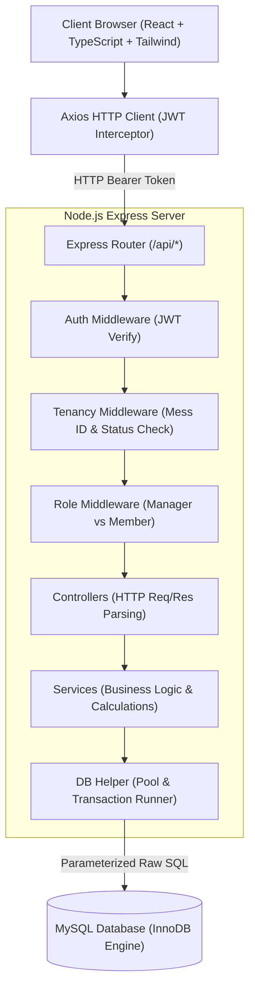
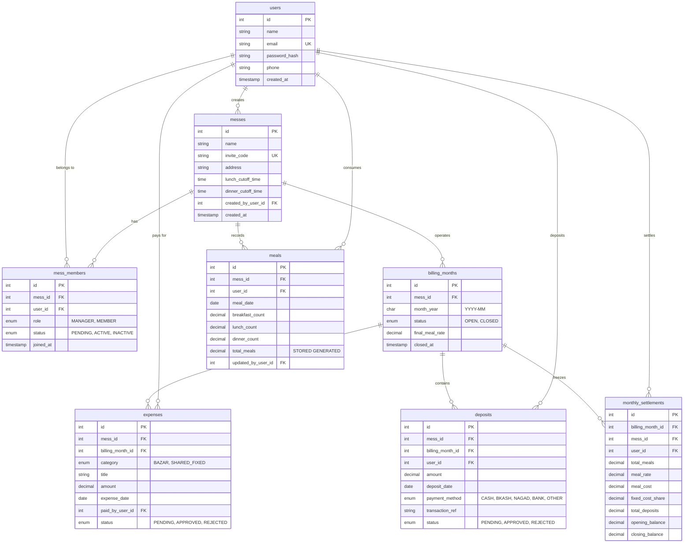

# TECHNICAL ARCHITECTURE & SYSTEM DESIGN DOCUMENT
**System**: Mess Management System  
**Version**: `1.0.0` (MVP Architecture)  
**Status**: `APPROVED FOR IMPLEMENTATION`  
**Stack**: React + TypeScript + Vite + Tailwind CSS | Node.js + Express.js + TypeScript | MySQL (mysql2/promise + Raw SQL)  

---

## 1. System Topology & Architectural Overview

The application follows a decoupled, client-server architecture. The frontend is a Single Page Application (SPA) built with React and Vite, communicating via JSON REST APIs over HTTP/HTTPS with a Node.js Express backend. The backend persists data directly into a MySQL relational database using parameterized raw SQL queries via the `mysql2/promise` connection pool (no ORM).



---

## 2. Database Schema Design (MySQL + Raw SQL)

### 2.1 Entity Relationship Diagram (ERD)



### 2.2 Table Specifications & Design Decisions

#### 1. `users`
- `id`: `INT AUTO_INCREMENT PRIMARY KEY`
- `email`: `VARCHAR(150) NOT NULL UNIQUE`. Used as the login identifier.
- `password_hash`: `VARCHAR(255) NOT NULL`. Accommodates bcrypt hashes (typically 60 chars).
- *Indexing*: `idx_user_email` for instantaneous credential lookup on login.

#### 2. `messes`
- `invite_code`: `VARCHAR(12) NOT NULL UNIQUE`. A short, random alphanumeric string (e.g., `MESS-8X2K9`) generated during mess creation.
- `lunch_cutoff_time`, `dinner_cutoff_time`: `TIME DEFAULT '09:00:00'` and `'16:00:00'`. Defines the daily deadline for members to modify their meals for lunch and dinner.
- `created_by_user_id`: `INT NOT NULL FK`. Links to the founding manager.

#### 3. `mess_members`
- Composite Unique Key: `UNIQUE KEY uq_mess_user (mess_id, user_id)` guarantees a user can only have one active membership record per mess.
- `status`: `ENUM('PENDING', 'ACTIVE', 'INACTIVE')`. Enables the approval workflow where new sign-ups enter as `PENDING` until approved by the Manager.

#### 4. `billing_months`
- `month_year`: `CHAR(7) NOT NULL` (Format `'YYYY-MM'`, e.g., `'2026-09'`).
- `status`: `ENUM('OPEN', 'CLOSED')`. When marked `'CLOSED'`, backend endpoints reject any new meals, expenses, or deposits assigned to this month.
- `final_meal_rate`: `DECIMAL(10, 4) DEFAULT 0.0000`. Stored with 4 decimal places to prevent rounding drift over large numbers of meals.

#### 5. `meals`
- `breakfast_count`, `lunch_count`, `dinner_count`: `DECIMAL(4, 2) DEFAULT 0.00`. Allows granular counts like `0.5` (half meal) or `2.0` (member + guest).
- `total_meals`: `DECIMAL(5, 2) GENERATED ALWAYS AS (breakfast_count + lunch_count + dinner_count) STORED`.
  - *Trade-off explanation*: Using a stored generated column guarantees calculation consistency at the database level and eliminates repetitive calculation in `SELECT SUM(breakfast + lunch + dinner)` queries.
- Composite Unique Key: `UNIQUE KEY uq_member_meal_date (mess_id, user_id, meal_date)`. Guarantees exactly one record per member per day. Updates utilize `INSERT ... ON DUPLICATE KEY UPDATE`.

#### 6. `expenses`
- `category`: `ENUM('BAZAR', 'SHARED_FIXED')`. Crucial architectural distinction:
  - `BAZAR`: Food groceries that determine the variable meal rate.
  - `SHARED_FIXED`: Utility/rent/cook costs that divide equally per member.
- `status`: `ENUM('PENDING', 'APPROVED', 'REJECTED')`. Unapproved items are excluded from calculation queries.
- Indexing: `INDEX idx_expenses_filter (mess_id, billing_month_id, category, status)`. Highly optimized for dashboard and report aggregation queries.

#### 7. `deposits`
- `amount`: `DECIMAL(10, 2) NOT NULL`.
- `status`: `ENUM('PENDING', 'APPROVED', 'REJECTED')`.
- Indexing: `INDEX idx_deposits_filter (mess_id, billing_month_id, status)`.

#### 8. `monthly_settlements`
- Serves as an immutable snapshot created when the manager executes "Close Month".
- Stores `opening_balance`, `total_meals`, `meal_rate`, `meal_cost`, `fixed_cost_share`, `total_deposits`, and final `closing_balance`.
- Guarantees historical audits remain 100% accurate even if members leave the mess in subsequent months.

---

### 2.3 Key Raw SQL Query Patterns

#### Pattern 1: Upsert Daily Meal Entry (Idempotent)
```sql
INSERT INTO meals (mess_id, user_id, meal_date, breakfast_count, lunch_count, dinner_count, updated_by_user_id)
VALUES (?, ?, ?, ?, ?, ?, ?)
ON DUPLICATE KEY UPDATE
    breakfast_count = VALUES(breakfast_count),
    lunch_count = VALUES(lunch_count),
    dinner_count = VALUES(dinner_count),
    updated_by_user_id = VALUES(updated_by_user_id),
    updated_at = CURRENT_TIMESTAMP;
```

#### Pattern 2: Live Monthly Dashboard Aggregation
```sql
-- Fetch aggregate metrics in a single efficient query
SELECT 
    COALESCE(SUM(CASE WHEN e.category = 'BAZAR' AND e.status = 'APPROVED' THEN e.amount ELSE 0 END), 0.00) AS total_bazar,
    COALESCE(SUM(CASE WHEN e.category = 'SHARED_FIXED' AND e.status = 'APPROVED' THEN e.amount ELSE 0 END), 0.00) AS total_fixed
FROM expenses e
WHERE e.mess_id = ? AND e.billing_month_id = ?;

-- Fetch total mess meals
SELECT COALESCE(SUM(total_meals), 0.00) AS total_mess_meals
FROM meals m
WHERE m.mess_id = ? 
  AND m.meal_date >= ? AND m.meal_date <= ?;
```

#### Pattern 3: Member Live Ledger Query
```sql
SELECT 
    u.id AS user_id,
    u.name,
    u.email,
    COALESCE(meal_agg.member_meals, 0.00) AS total_meals,
    COALESCE(dep_agg.member_deposits, 0.00) AS total_deposits
FROM mess_members mm
JOIN users u ON u.id = mm.user_id
LEFT JOIN (
    SELECT user_id, SUM(total_meals) AS member_meals
    FROM meals
    WHERE mess_id = ? AND meal_date >= ? AND meal_date <= ?
    GROUP BY user_id
) meal_agg ON meal_agg.user_id = u.id
LEFT JOIN (
    SELECT user_id, SUM(amount) AS member_deposits
    FROM deposits
    WHERE mess_id = ? AND billing_month_id = ? AND status = 'APPROVED'
    GROUP BY user_id
) dep_agg ON dep_agg.user_id = u.id
WHERE mm.mess_id = ? AND mm.status = 'ACTIVE';
```

---

## 3. Backend Architecture (Express.js + TypeScript)

### 3.1 Layered Architecture Pattern

The backend follows a strict 4-layer structure to separate concerns without ORM bloat:
1. **Routing Layer (`src/routes/`)**: Registers URL paths, binds HTTP verbs, and chains authentication and authorization middlewares.
2. **Middleware Layer (`src/middlewares/`)**: Validates JWTs, checks role permissions, validates request schemas, and handles centralized errors.
3. **Controller Layer (`src/controllers/`)**: Parses HTTP requests (`req.params`, `req.query`, `req.body`), passes parameters to the service layer, and shapes JSON responses.
4. **Service Layer (`src/services/`)**: Contains all business logic, cutoff validations, mathematical calculations, and raw SQL queries using the database connection pool.

```
Request ➡️ [Routes] ➡️ [Middlewares] ➡️ [Controllers] ➡️ [Services] ➡️ [mysql2 Pool] ➡️ MySQL
Response ⬅️ [JSON Envelope] ⬅️ [Controllers] ⬅️ [Data / Domain Objects] ⬅️ [Raw Rows]
```

### 3.2 Database Connection & Transaction Runner Helper

To prevent connection leaks and simplify transactions, we create a robust `db.ts` module:

```typescript
// src/config/db.ts
import mysql from 'mysql2/promise';
import { env } from './env';

export const pool = mysql.createPool({
  host: env.DB_HOST,
  port: env.DB_PORT,
  user: env.DB_USER,
  password: env.DB_PASSWORD,
  database: env.DB_NAME,
  waitForConnections: true,
  connectionLimit: 10,
  queueLimit: 0,
  decimalNumbers: true, // Automatically parse DECIMAL as JavaScript numbers
});

// Transaction Runner Helper for atomic operations
export async function withTransaction<T>(
  callback: (connection: mysql.PoolConnection) => Promise<T>
): Promise<T> {
  const connection = await pool.getConnection();
  try {
    await connection.beginTransaction();
    const result = await callback(connection);
    await connection.commit();
    return result;
  } catch (error) {
    await connection.rollback();
    throw error;
  } finally {
    connection.release();
  }
}
```

### 3.3 Authentication & Authorization Middleware Pipeline

```typescript
// Middleware Execution Sequence:
// 1. authenticate: Validates "Bearer <JWT>" -> Attaches req.user = { userId, email }
// 2. requireMessMember: Validates that req.user is an ACTIVE member of req.params.messId (or req.body.messId)
// 3. requireRole('MANAGER'): Validates that req.member.role === 'MANAGER'
```

- **Tenancy Guard**: Every data query is scoped by `mess_id`. Users cannot access or mutate meals, expenses, or deposits of another mess even if they guess valid record IDs.

### 3.4 Server-Side Cutoff Enforcement Service

```typescript
export function isMealLocked(
  mealDateStr: string,
  slot: 'BREAKFAST' | 'LUNCH' | 'DINNER',
  lunchCutoff: string,   // e.g. "09:00:00"
  dinnerCutoff: string   // e.g. "16:00:00"
): boolean {
  const now = new Date();
  const mealDate = new Date(mealDateStr);

  // If meal is in the past, it's locked for members
  const todayStr = now.toISOString().split('T')[0];
  if (mealDateStr < todayStr) return true;

  // If meal is in the future (tomorrow or beyond), it is open
  if (mealDateStr > todayStr) return false;

  // Meal is TODAY: Check slot cutoffs
  const currentHourMinSec = now.toTimeString().split(' ')[0]; // "HH:MM:SS"

  if (slot === 'BREAKFAST') {
    // Breakfast locks at the same time as lunch or 07:00 AM
    return currentHourMinSec > '07:00:00';
  }
  if (slot === 'LUNCH') {
    return currentHourMinSec > lunchCutoff;
  }
  if (slot === 'DINNER') {
    return currentHourMinSec > dinnerCutoff;
  }

  return false;
}
```

---

## 4. Frontend Architecture (React + Vite + Tailwind CSS)

### 4.1 State Management & Architecture Principles

- **No Over-Engineering**: We avoid Redux/Zustand for the MVP. Standard **React Context** (`AuthContext`) handles authentication state (token, current user, active mess membership).
- **Server Cache & Data Fetching**: A custom lightweight hook pattern (`useFetchData` or direct `useEffect` with clean state management) handles asynchronous fetching and revalidation.
- **Form Management**: Native React controlled components with localized validation.

### 4.2 Application Route Hierarchy & Guards

```tsx
// Frontend Route Structure (React Router v6/v7)
<Routes>
  {/* Public Routes */}
  <Route element={<PublicLayout />}>
    <Route path="/login" element={<LoginPage />} />
    <Route path="/register" element={<RegisterPage />} />
  </Route>

  {/* Protected Routes (Requires valid JWT) */}
  <Route element={<ProtectedRoute />}>
    <Route path="/onboarding" element={<OnboardingPage />} /> {/* Create or Join Mess */}

    {/* Mess Tenant Context Routes (Requires ACTIVE membership in a mess) */}
    <Route element={<AppLayout />}>
      <Route path="/dashboard" element={<DashboardPage />} />
      <Route path="/meals" element={<MealsPage />} />
      <Route path="/expenses" element={<ExpensesPage />} />
      <Route path="/deposits" element={<DepositsPage />} />
      <Route path="/members" element={<MembersPage />} />
      <Route path="/settlement" element={<SettlementPage />} />
      
      {/* Manager Only Routes */}
      <Route element={<ManagerRoute />}>
        <Route path="/settings" element={<SettingsPage />} />
      </Route>
    </Route>
  </Route>

  <Route path="*" element={<Navigate to="/dashboard" replace />} />
</Routes>
```

### 4.3 Axios Interceptor Architecture

```typescript
// src/services/api.ts
import axios from 'axios';

export const api = axios.create({
  baseURL: import.meta.env.VITE_API_URL || 'http://localhost:5000/api',
  headers: {
    'Content-Type': 'application/json',
  },
});

// Attach Bearer token to all outgoing requests
api.interceptors.request.use((config) => {
  const token = localStorage.getItem('token');
  if (token && config.headers) {
    config.headers.Authorization = `Bearer ${token}`;
  }
  return config;
});

// Handle 401 Unauthorized globally
api.interceptors.response.use(
  (response) => response,
  (error) => {
    if (error.response?.status === 401) {
      localStorage.removeItem('token');
      localStorage.removeItem('user');
      window.location.href = '/login';
    }
    return Promise.reject(error);
  }
);
```

### 4.4 Component Hierarchy & Design System

The UI uses a modern, high-contrast Tailwind design with clean cards, status badges, responsive tables, and intuitive modals.

```
AppLayout
├── Navbar (User profile dropdown, active Mess name, Invite Code badge, Logout)
├── Sidebar (Navigation links with active highlight: Dashboard, Meals, Expenses, Deposits, Members, Settlement, Settings)
└── Main Content Container
    ├── Page Header (Title, Month Selector dropdown, Action button e.g., "Add Expense")
    └── Page Body
        ├── StatCard Grid (Meal Rate, Live Balance, Total Meals, Total Bazar)
        ├── Dynamic Interactive Widgets (Quick-toggle meals, Daily spreadsheet grid)
        └── Data Tables (Filterable by category/status, pagination/scroll)
```

---

## 5. End-to-End Execution Trace Examples

### Scenario 1: Member Updates Today's Lunch Count
1. **User Action**: Member clicks `+` on the Lunch meal card for today's date (`2026-09-16`).
2. **Frontend**:
   - Checks local cutoff time (displays warning if expired).
   - Issues `PUT /api/meals/self` with `{ messId: 1, mealDate: '2026-09-16', lunchCount: 1.0 }`.
3. **Backend Middleware**:
   - `auth.middleware.ts` validates JWT -> sets `req.user`.
   - `tenant.middleware.ts` confirms user is `ACTIVE` member of `mess_id = 1`.
4. **Backend Service**:
   - `meal.service.ts` queries mess settings for `lunch_cutoff_time` and billing month status.
   - Evaluates `isMealLocked()`. If server time > cutoff time, throws `403 Forbidden ("Lunch cutoff has passed")`.
   - If valid, runs `INSERT ... ON DUPLICATE KEY UPDATE` into `meals` table.
5. **Response**: Returns updated meal record. Frontend updates UI with a green confirmation toast.

### Scenario 2: Manager Closes Month (`2026-09`)
1. **User Action**: Manager navigates to `/settlement` and clicks **"Close & Settle Month"**.
2. **Frontend**: Displays confirmation modal with summary totals (Total Meals: 365, Total Bazar: ৳15,450, Final Rate: ৳42.27, Active Members: 6). Manager confirms.
3. **Backend**:
   - Calls `POST /api/settlements/close-month` with `{ messId: 1, monthYear: '2026-09' }`.
   - Validates caller is `MANAGER`.
   - Starts atomic transaction via `withTransaction()`:
     1. Asserts no `PENDING` expenses or deposits exist for `'2026-09'`.
     2. Calculates final meal rate: $15450 / 365.5 = 42.2708$.
     3. For each active member, retrieves opening balance, calculates meal cost and fixed share, computes closing balance, and inserts into `monthly_settlements`.
     4. Updates `billing_months` row for `'2026-09'` to `status = 'CLOSED'`, `final_meal_rate = 42.2708`, `closed_at = NOW()`.
     5. Creates or verifies next month `'2026-10'` in `billing_months` with `status = 'OPEN'`.
   - Commits transaction.
4. **Response**: Returns success envelope with settled member statements.
5. **Frontend**: Refreshes view, locks previous month inputs, and displays the immutable audit report.

---

## 6. Architecture Approval & Implementation Readiness

| Architecture Component | Status | Verification Note |
| :--- | :---: | :--- |
| **Relational MySQL Schema** | Fully Specified | DDL written, indexed, normalized, constraints validated |
| **Backend Layering** | Fully Specified | Clean routes/middleware/controllers/services pattern |
| **Database Access Layer** | Fully Specified | `mysql2/promise` pool with `withTransaction()` helper |
| **Authorization & Tenancy** | Fully Specified | Multi-mess isolation via `mess_id` and role middleware |
| **Frontend Component Tree** | Fully Specified | React Router, Auth Context, Axios interceptors, responsive Tailwind UI |
| **Zero ORM Constraint** | Satisfied | Pure parameterized raw SQL queries throughout |

This document serves as the complete architectural blueprint for the development phases.
