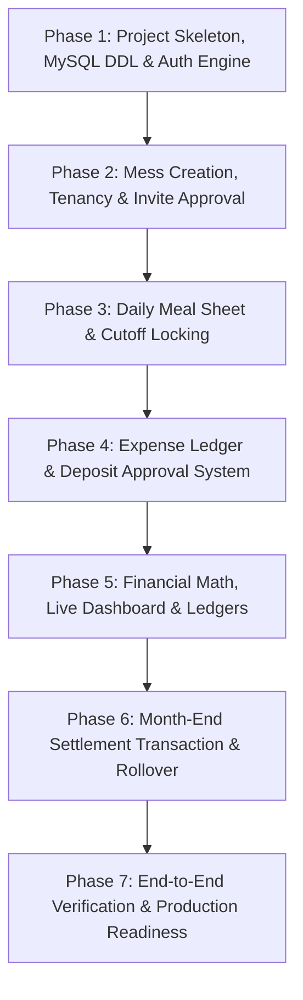

# FINAL MVP SPECIFICATION: MESS MANAGEMENT SYSTEM
**Document Status**: `FROZEN`  
**Version**: `1.0.0`  
**Target Audience**: Solo Full-Stack Developer (Portfolio Project)  
**Tech Stack**: React + TypeScript + Vite + Tailwind CSS | Node.js + Express.js + TypeScript | MySQL (mysql2 + raw SQL) | JWT + bcrypt | Axios  

---

## 1. Executive Summary
The **Mess Management System** is a multi-tenant web application engineered to eliminate disputes, manual arithmetic errors, and lack of transparency in bachelor and student shared living environments ("messes"). 

This document serves as the **frozen contractual blueprint** for the Minimum Viable Product (MVP). All features, edge cases, formulas, database schemas, and API contracts defined herein are locked. No out-of-scope features will be introduced until MVP deployment is complete.

---

## 2. Scope & Boundary Definition

### 2.1 Strictly In Scope (MVP)
1. **Multi-Mess Tenancy**: User registration, Mess creation, and joining via unique 6-character Invite Codes.
2. **Role-Based Access Control (RBAC)**: Dual-role structure (`MANAGER` and `MEMBER`) with status-based governance (`PENDING`, `ACTIVE`, `INACTIVE`).
3. **Daily Meal Management**:
   - Discrete slots: Breakfast (0.5), Lunch (1.0), Dinner (1.0).
   - Member self-reporting with server-enforced cutoff times.
   - Manager master daily grid for viewing and overriding any member's count on any date.
4. **Dual-Category Expenses**:
   - **Bazar (Grocery)**: Items contributing to dynamic meal rate.
   - **Shared/Fixed**: Overhead expenses (rent, utilities, maid) split equally among active members.
   - Member submission workflow with Manager verification (`PENDING` -> `APPROVED` / `REJECTED`).
5. **Deposit Tracking**:
   - Submission of deposits (`CASH`, `BKASH`, `NAGAD`, `BANK`) with transaction reference.
   - Manager approval workflow and real-time ledger crediting.
6. **Real-time Live Dashboard**:
   - Live meal rate, total mess meals, total bazar expense, shared fixed costs, and real-time member balance.
7. **Month-End Settlement & Rollover Engine**:
   - Atomically closes a calendar month (`YYYY-MM`).
   - Freezes historical data to prevent retrospective edits.
   - Generates immutable member billing statements.
   - Automatically carries forward net surplus or due as next month's opening balance.

### 2.2 Strictly Out of Scope (Deferred to Post-MVP)
- Physical receipt image/file uploads (using text notes and transaction references instead).
- SMS or WhatsApp automated notification integrations (in-app alerts and notifications only).
- Automated payment gateway webhooks (manual deposit reconciliation instead).
- Multi-currency or multi-language localization.
- Export to PDF / Excel (can be added in Phase 2).

---

## 3. User Roles & Permission Matrix

| Capability | Unauthenticated | Member (Pending) | Member (Active) | Manager |
| :--- | :---: | :---: | :---: | :---: |
| Register / Login | Yes | No | No | No |
| Create a new Mess | No | Yes | Yes (in another context) | Yes |
| Join a Mess via Invite Code | No | Yes | No (already joined) | No |
| View Live Dashboard | No | No | Yes | Yes |
| Submit Daily Meals (before cutoff) | No | No | Yes (Self only) | Yes (All members) |
| Override Past Meals / After Cutoff | No | No | No | Yes |
| Submit Bazar / Fixed Expense | No | No | Yes (Pending) | Yes (Auto-approved) |
| Approve / Reject Expenses | No | No | No | Yes |
| Submit Deposit Request | No | No | Yes (Pending) | Yes (Auto-approved) |
| Approve / Reject Deposits | No | No | No | Yes |
| Approve / Reject Join Requests | No | No | No | Yes |
| Update Mess Settings / Cutoffs | No | No | No | Yes |
| Close & Settle Month | No | No | No | Yes |
| Reassign Manager Role | No | No | No | Yes |

---

## 4. Business Rules, Edge Cases & Guardrails

### 4.1 Daily Meal Rules
1. **Meal Units**:
   - Breakfast: Default `0.5`, range `[0.0, 5.0]` (allows guest meals).
   - Lunch: Default `1.0`, range `[0.0, 5.0]`.
   - Dinner: Default `1.0`, range `[0.0, 5.0]`.
2. **Server-Side Cutoff Enforcement**:
   - Members cannot update their meal entry for a slot after its cutoff time (e.g. Lunch cutoff at `09:00:00`, Dinner cutoff at `16:00:00`).
   - Cutoff logic is evaluated against the database/server clock, never client browser time.
   - The Manager bypasses cutoff times and can adjust any meal record within an `OPEN` billing month.
3. **Historical Lock**:
   - No meals can be inserted, updated, or deleted for a month whose `billing_months.status` is `'CLOSED'`.

### 4.2 Expense Rules
1. **Category Distinction**:
   - `BAZAR`: Consumables and ingredients. Costs are distributed proportionally based on meal counts eaten.
   - `SHARED_FIXED`: Flat communal costs (rent, cook, electricity, internet). Costs are divided equally among all `ACTIVE` members in that billing month.
2. **Approval Obligation**:
   - Only `APPROVED` expenses are included in meal rate calculations and member ledger balances. `PENDING` and `REJECTED` expenses are excluded.

### 4.3 Deposit Rules
1. **Reconciliation**:
   - Only `APPROVED` deposits credit a member's ledger.
   - Direct deposits created by the Manager are inserted directly with `status = 'APPROVED'`.

### 4.4 Edge Cases & Protections
1. **Zero Total Meals Safeguard**:
   - If `Total Mess Meals == 0`, `Meal Rate` is defined as `0.0000` (prevents division by zero runtime errors).
2. **Zero Active Members Safeguard**:
   - If `Active Members == 0`, `Fixed Cost Share` is defined as `0.00`.
3. **Mid-Month Join/Leave**:
   - A member marked `ACTIVE` anytime during the month participates in that month's fixed expenses.
4. **Idempotent Month Closing**:
   - Month closure cannot be executed twice for the same `(mess_id, month_year)`.
   - Month closure is rejected if any unhandled `PENDING` expenses or deposits exist for that month.

---

## 5. Mathematical Calculation Specifications

### 5.1 Dynamic Meal Rate Formula
$$\text{Total Bazar Expense} = \sum_{\substack{e \in \text{Expenses} \\ e.\text{category} = \text{'BAZAR'} \\ e.\text{status} = \text{'APPROVED'}}} e.\text{amount}$$

$$\text{Total Mess Meals} = \sum_{m \in \text{Meals}} (m.\text{breakfast\_count} + m.\text{lunch\_count} + m.\text{dinner\_count})$$

$$\text{Meal Rate} = \begin{cases} \frac{\text{Total Bazar Expense}}{\text{Total Mess Meals}}, & \text{if Total Mess Meals} > 0 \\ 0.0000, & \text{if Total Mess Meals} = 0 \end{cases}$$

*Precision: Stored as `DECIMAL(10, 4)` to eliminate rounding drift across thousands of meals.*

### 5.2 Shared Fixed Cost Share
$$\text{Total Fixed Expense} = \sum_{\substack{e \in \text{Expenses} \\ e.\text{category} = \text{'SHARED\_FIXED'} \\ e.\text{status} = \text{'APPROVED'}}} e.\text{amount}$$

$$\text{Active Member Count} = \text{COUNT}(\text{Members with status = 'ACTIVE'}) \text{ in current mess}$$

$$\text{Member Fixed Share} = \begin{cases} \frac{\text{Total Fixed Expense}}{\text{Active Member Count}}, & \text{if Active Member Count} > 0 \\ 0.00, & \text{otherwise} \end{cases}$$

### 5.3 Live Member Balance Calculation
For a specific member $u$ in month $M$:
$$\text{Member Total Meals}_u = \sum_{m \in \text{Meals}_u} m.\text{total\_meals}$$

$$\text{Member Meal Cost}_u = \text{Member Total Meals}_u \times \text{Current Meal Rate}$$

$$\text{Member Total Deposits}_u = \sum_{\substack{d \in \text{Deposits}_u \\ d.\text{status} = \text{'APPROVED'}}} d.\text{amount}$$

$$\text{Opening Balance}_u = \begin{cases} \text{closing\_balance from month } (M-1), & \text{if exists} \\ 0.00, & \text{otherwise} \end{cases}$$

$$\text{Total Expense Obligation}_u = \text{Member Meal Cost}_u + \text{Member Fixed Share}$$

$$\text{Net Live Balance}_u = \text{Opening Balance}_u + \text{Member Total Deposits}_u - \text{Total Expense Obligation}_u$$

- **Positive Balance ($> 0$)**: Credit (Mess owes the member or funds carried forward).
- **Negative Balance ($< 0$)**: Due (Member owes money to the mess).

---

## 6. Complete Database Specification (MySQL DDL)

```sql
-- Character Set and Engine: utf8mb4 / InnoDB for full Unicode support and ACID transactions.
SET FOREIGN_KEY_CHECKS = 0;

-- 1. USERS
CREATE TABLE IF NOT EXISTS users (
    id INT AUTO_INCREMENT PRIMARY KEY,
    name VARCHAR(100) NOT NULL,
    email VARCHAR(150) NOT NULL UNIQUE,
    password_hash VARCHAR(255) NOT NULL,
    phone VARCHAR(20) NULL,
    created_at TIMESTAMP DEFAULT CURRENT_TIMESTAMP,
    updated_at TIMESTAMP DEFAULT CURRENT_TIMESTAMP ON UPDATE CURRENT_TIMESTAMP,
    INDEX idx_user_email (email)
) ENGINE=InnoDB DEFAULT CHARSET=utf8mb4 COLLATE=utf8mb4_unicode_ci;

-- 2. MESSES
CREATE TABLE IF NOT EXISTS messes (
    id INT AUTO_INCREMENT PRIMARY KEY,
    name VARCHAR(100) NOT NULL,
    invite_code VARCHAR(12) NOT NULL UNIQUE,
    address VARCHAR(255) NULL,
    lunch_cutoff_time TIME DEFAULT '09:00:00',
    dinner_cutoff_time TIME DEFAULT '16:00:00',
    created_by_user_id INT NOT NULL,
    created_at TIMESTAMP DEFAULT CURRENT_TIMESTAMP,
    updated_at TIMESTAMP DEFAULT CURRENT_TIMESTAMP ON UPDATE CURRENT_TIMESTAMP,
    CONSTRAINT fk_messes_creator FOREIGN KEY (created_by_user_id) REFERENCES users(id) ON DELETE RESTRICT,
    INDEX idx_mess_code (invite_code)
) ENGINE=InnoDB DEFAULT CHARSET=utf8mb4 COLLATE=utf8mb4_unicode_ci;

-- 3. MESS MEMBERS (TENANCY JOIN TABLE)
CREATE TABLE IF NOT EXISTS mess_members (
    id INT AUTO_INCREMENT PRIMARY KEY,
    mess_id INT NOT NULL,
    user_id INT NOT NULL,
    role ENUM('MANAGER', 'MEMBER') DEFAULT 'MEMBER',
    status ENUM('PENDING', 'ACTIVE', 'INACTIVE') DEFAULT 'PENDING',
    joined_at TIMESTAMP DEFAULT CURRENT_TIMESTAMP,
    CONSTRAINT fk_mm_mess FOREIGN KEY (mess_id) REFERENCES messes(id) ON DELETE CASCADE,
    CONSTRAINT fk_mm_user FOREIGN KEY (user_id) REFERENCES users(id) ON DELETE CASCADE,
    UNIQUE KEY uq_mess_user (mess_id, user_id),
    INDEX idx_mm_status (mess_id, status)
) ENGINE=InnoDB DEFAULT CHARSET=utf8mb4 COLLATE=utf8mb4_unicode_ci;

-- 4. BILLING MONTHS (CYCLE CONTROL & HISTORICAL LOCKS)
CREATE TABLE IF NOT EXISTS billing_months (
    id INT AUTO_INCREMENT PRIMARY KEY,
    mess_id INT NOT NULL,
    month_year CHAR(7) NOT NULL, -- Format: 'YYYY-MM'
    status ENUM('OPEN', 'CLOSED') DEFAULT 'OPEN',
    final_meal_rate DECIMAL(10, 4) DEFAULT 0.0000,
    closed_at TIMESTAMP NULL,
    created_at TIMESTAMP DEFAULT CURRENT_TIMESTAMP,
    CONSTRAINT fk_bm_mess FOREIGN KEY (mess_id) REFERENCES messes(id) ON DELETE CASCADE,
    UNIQUE KEY uq_mess_month (mess_id, month_year),
    INDEX idx_bm_lookup (mess_id, status)
) ENGINE=InnoDB DEFAULT CHARSET=utf8mb4 COLLATE=utf8mb4_unicode_ci;

-- 5. DAILY MEALS
CREATE TABLE IF NOT EXISTS meals (
    id INT AUTO_INCREMENT PRIMARY KEY,
    mess_id INT NOT NULL,
    user_id INT NOT NULL,
    meal_date DATE NOT NULL,
    breakfast_count DECIMAL(4, 2) DEFAULT 0.00,
    lunch_count DECIMAL(4, 2) DEFAULT 0.00,
    dinner_count DECIMAL(4, 2) DEFAULT 0.00,
    total_meals DECIMAL(5, 2) GENERATED ALWAYS AS (breakfast_count + lunch_count + dinner_count) STORED,
    updated_by_user_id INT NOT NULL,
    created_at TIMESTAMP DEFAULT CURRENT_TIMESTAMP,
    updated_at TIMESTAMP DEFAULT CURRENT_TIMESTAMP ON UPDATE CURRENT_TIMESTAMP,
    CONSTRAINT fk_meals_mess FOREIGN KEY (mess_id) REFERENCES messes(id) ON DELETE CASCADE,
    CONSTRAINT fk_meals_user FOREIGN KEY (user_id) REFERENCES users(id) ON DELETE CASCADE,
    CONSTRAINT fk_meals_updater FOREIGN KEY (updated_by_user_id) REFERENCES users(id) ON DELETE RESTRICT,
    UNIQUE KEY uq_member_meal_date (mess_id, user_id, meal_date),
    INDEX idx_meals_query (mess_id, meal_date)
) ENGINE=InnoDB DEFAULT CHARSET=utf8mb4 COLLATE=utf8mb4_unicode_ci;

-- 6. EXPENSES (BAZAR & SHARED FIXED)
CREATE TABLE IF NOT EXISTS expenses (
    id INT AUTO_INCREMENT PRIMARY KEY,
    mess_id INT NOT NULL,
    billing_month_id INT NOT NULL,
    category ENUM('BAZAR', 'SHARED_FIXED') NOT NULL,
    title VARCHAR(150) NOT NULL,
    description TEXT NULL,
    amount DECIMAL(10, 2) NOT NULL,
    expense_date DATE NOT NULL,
    paid_by_user_id INT NOT NULL,
    status ENUM('PENDING', 'APPROVED', 'REJECTED') DEFAULT 'APPROVED',
    created_at TIMESTAMP DEFAULT CURRENT_TIMESTAMP,
    updated_at TIMESTAMP DEFAULT CURRENT_TIMESTAMP ON UPDATE CURRENT_TIMESTAMP,
    CONSTRAINT fk_exp_mess FOREIGN KEY (mess_id) REFERENCES messes(id) ON DELETE CASCADE,
    CONSTRAINT fk_exp_month FOREIGN KEY (billing_month_id) REFERENCES billing_months(id) ON DELETE RESTRICT,
    CONSTRAINT fk_exp_payer FOREIGN KEY (paid_by_user_id) REFERENCES users(id) ON DELETE RESTRICT,
    INDEX idx_expenses_filter (mess_id, billing_month_id, category, status)
) ENGINE=InnoDB DEFAULT CHARSET=utf8mb4 COLLATE=utf8mb4_unicode_ci;

-- 7. DEPOSITS
CREATE TABLE IF NOT EXISTS deposits (
    id INT AUTO_INCREMENT PRIMARY KEY,
    mess_id INT NOT NULL,
    billing_month_id INT NOT NULL,
    user_id INT NOT NULL,
    amount DECIMAL(10, 2) NOT NULL,
    deposit_date DATE NOT NULL,
    payment_method ENUM('CASH', 'BKASH', 'NAGAD', 'BANK', 'OTHER') DEFAULT 'CASH',
    transaction_ref VARCHAR(100) NULL,
    notes VARCHAR(255) NULL,
    status ENUM('PENDING', 'APPROVED', 'REJECTED') DEFAULT 'PENDING',
    created_at TIMESTAMP DEFAULT CURRENT_TIMESTAMP,
    updated_at TIMESTAMP DEFAULT CURRENT_TIMESTAMP ON UPDATE CURRENT_TIMESTAMP,
    CONSTRAINT fk_dep_mess FOREIGN KEY (mess_id) REFERENCES messes(id) ON DELETE CASCADE,
    CONSTRAINT fk_dep_month FOREIGN KEY (billing_month_id) REFERENCES billing_months(id) ON DELETE RESTRICT,
    CONSTRAINT fk_dep_user FOREIGN KEY (user_id) REFERENCES users(id) ON DELETE CASCADE,
    INDEX idx_deposits_filter (mess_id, billing_month_id, status)
) ENGINE=InnoDB DEFAULT CHARSET=utf8mb4 COLLATE=utf8mb4_unicode_ci;

-- 8. MONTHLY SETTLEMENTS (IMMUTABLE AUDIT LOG)
CREATE TABLE IF NOT EXISTS monthly_settlements (
    id INT AUTO_INCREMENT PRIMARY KEY,
    billing_month_id INT NOT NULL,
    mess_id INT NOT NULL,
    user_id INT NOT NULL,
    total_meals DECIMAL(6, 2) NOT NULL,
    meal_rate DECIMAL(10, 4) NOT NULL,
    meal_cost DECIMAL(10, 2) NOT NULL,
    fixed_cost_share DECIMAL(10, 2) NOT NULL,
    total_deposits DECIMAL(10, 2) NOT NULL,
    opening_balance DECIMAL(10, 2) DEFAULT 0.00,
    closing_balance DECIMAL(10, 2) NOT NULL,
    created_at TIMESTAMP DEFAULT CURRENT_TIMESTAMP,
    CONSTRAINT fk_settle_month FOREIGN KEY (billing_month_id) REFERENCES billing_months(id) ON DELETE CASCADE,
    CONSTRAINT fk_settle_mess FOREIGN KEY (mess_id) REFERENCES messes(id) ON DELETE CASCADE,
    CONSTRAINT fk_settle_user FOREIGN KEY (user_id) REFERENCES users(id) ON DELETE CASCADE,
    UNIQUE KEY uq_settle_member (billing_month_id, user_id)
) ENGINE=InnoDB DEFAULT CHARSET=utf8mb4 COLLATE=utf8mb4_unicode_ci;

SET FOREIGN_KEY_CHECKS = 1;
```

---

## 7. API Endpoint Contracts

All responses follow standard envelope:
```json
{
  "success": true,
  "data": { ... },
  "message": "Optional user-friendly message"
}
```
Error response envelope:
```json
{
  "success": false,
  "error": {
    "code": "BAD_REQUEST",
    "message": "Specific failure explanation"
  }
}
```

### 7.1 Authentication & User
- `POST /api/auth/register`  
  - Body: `{ name, email, password, phone? }`  
  - Response: `{ token, user: { id, name, email } }`
- `POST /api/auth/login`  
  - Body: `{ email, password }`  
  - Response: `{ token, user, messMembership?: { messId, role, status } }`
- `GET /api/auth/me`  
  - Headers: `Authorization: Bearer <token>`  
  - Response: Current user profile with all mess memberships.

### 7.2 Mess & Member Governance
- `POST /api/messes`  
  - Body: `{ name, address?, lunchCutoffTime?, dinnerCutoffTime? }`  
  - Result: Creates mess, sets caller as `MANAGER`, generates 6-char `invite_code`.
- `POST /api/messes/join`  
  - Body: `{ inviteCode }`  
  - Result: Adds member in `PENDING` status.
- `GET /api/messes/:messId/members`  
  - Returns list of members with roles, status, and joined dates.
- `PATCH /api/messes/:messId/members/:memberId/status` *(Manager only)*  
  - Body: `{ status: 'ACTIVE' | 'INACTIVE' | 'REJECTED' }`
- `PATCH /api/messes/:messId/settings` *(Manager only)*  
  - Body: `{ name?, address?, lunchCutoffTime?, dinnerCutoffTime? }`

### 7.3 Daily Meals
- `GET /api/meals/daily-sheet?messId=X&date=YYYY-MM-DD`  
  - Returns all members' meal records for the given date.
- `GET /api/meals/my-monthly?messId=X&month=YYYY-MM`  
  - Returns user's daily meal records for the requested month.
- `PUT /api/meals/self`  
  - Body: `{ messId, mealDate, breakfastCount?, lunchCount?, dinnerCount? }`  
  - Guard: Checks server time against cutoff times. Returns `403 FORBIDDEN` if past cutoff.
- `PUT /api/meals/manager-override` *(Manager only)*  
  - Body: `{ messId, userId, mealDate, breakfastCount, lunchCount, dinnerCount }`  
  - Guard: Checks that month is `OPEN`.

### 7.4 Expenses (Bazar & Shared)
- `GET /api/expenses?messId=X&month=YYYY-MM&category=ALL|BAZAR|SHARED_FIXED`  
  - Returns expense items with payer info and status.
- `POST /api/expenses`  
  - Body: `{ messId, category, title, description?, amount, expenseDate }`  
  - Logic: If caller is `MANAGER`, status is `APPROVED`; if `MEMBER`, status is `PENDING`.
- `PATCH /api/expenses/:id/status` *(Manager only)*  
  - Body: `{ status: 'APPROVED' | 'REJECTED' }`

### 7.5 Deposits
- `GET /api/deposits?messId=X&month=YYYY-MM`  
  - Returns deposit list with user details and status.
- `POST /api/deposits`  
  - Body: `{ messId, amount, depositDate, paymentMethod, transactionRef?, notes? }`  
  - Logic: If caller is `MANAGER`, status is `APPROVED`; if `MEMBER`, status is `PENDING`.
- `PATCH /api/deposits/:id/status` *(Manager only)*  
  - Body: `{ status: 'APPROVED' | 'REJECTED' }`

### 7.6 Dashboard & Analytics
- `GET /api/dashboard/summary?messId=X&month=YYYY-MM`  
  - Response:
    ```json
    {
      "monthYear": "2026-09",
      "status": "OPEN",
      "totalBazar": 15450.00,
      "totalMeals": 365.50,
      "currentMealRate": 42.2708,
      "totalFixed": 24000.00,
      "activeMemberCount": 6,
      "fixedSharePerMember": 4000.00
    }
    ```
- `GET /api/dashboard/member-ledger?messId=X&month=YYYY-MM`  
  - Returns array of all members with: `totalMeals`, `mealCost`, `fixedShare`, `totalDeposits`, `openingBalance`, `netBalance`.

### 7.7 Month-End Settlement
- `POST /api/settlements/close-month` *(Manager only)*  
  - Body: `{ messId, monthYear }`  
  - Transactional Execution: Verifies no pending items -> computes final rate & balances -> inserts `monthly_settlements` records -> updates `billing_months.status = 'CLOSED'` -> creates/opens next month.
- `GET /api/settlements/:messId/:monthYear`  
  - Returns immutable final audit sheet for closed month.

---

## 8. Frontend Architecture & Page Flow

### 8.1 Page Inventory
1. **Auth Pages**:
   - `/login`: Form with email/password and link to register.
   - `/register`: Form with name, email, phone, password.
2. **Onboarding Page**:
   - `/onboarding`: Displayed if user has no mess. Cards to "Create Mess" or "Join Mess with Code".
3. **Core Application Pages (Wrapped in AppLayout)**:
   - `/dashboard`: KPI cards (Meal Rate, My Balance, Total Bazar, Total Meals), Quick-Meal Toggle for Today, and Recent Activity feed.
   - `/meals`: 
     - *Member View*: Calendar/list of personal daily counts with cutoff countdown badges.
     - *Manager View*: Daily master spreadsheet grid to update anyone's count.
   - `/expenses`: Filterable table of Bazar & Fixed expenses with "Add Expense" modal and Manager approve/reject buttons.
   - `/deposits`: Deposit ledger with "Submit Deposit" modal and Manager approval controls.
   - `/members`: Member directory showing roles, status, join requests with Accept/Reject actions.
   - `/settlement`:
     - *Open Month*: Live calculation preview with "Close Month" button for Manager.
     - *Closed Month*: Frozen statement table showing breakdown of all members with surplus/due.
   - `/settings`: Manager updates cutoff times, mess name, and views the permanent invite code.

---

## 9. Directory Structure Specification

### 9.1 Backend (`backend/`)
```
backend/
├── src/
│   ├── config/
│   │   ├── db.ts               # mysql2/promise connection pool
│   │   └── env.ts              # env var validation
│   ├── controllers/
│   │   ├── auth.controller.ts
│   │   ├── mess.controller.ts
│   │   ├── meal.controller.ts
│   │   ├── expense.controller.ts
│   │   ├── deposit.controller.ts
│   │   ├── settlement.controller.ts
│   │   └── dashboard.controller.ts
│   ├── middlewares/
│   │   ├── auth.middleware.ts    # JWT verification
│   │   ├── role.middleware.ts    # requireManager / requireActiveMember
│   │   ├── validate.middleware.ts
│   │   └── errorHandler.ts
│   ├── routes/
│   │   ├── auth.routes.ts
│   │   ├── mess.routes.ts
│   │   ├── meal.routes.ts
│   │   ├── expense.routes.ts
│   │   ├── deposit.routes.ts
│   │   ├── settlement.routes.ts
│   │   ├── dashboard.routes.ts
│   │   └── index.ts
│   ├── services/
│   │   ├── auth.service.ts
│   │   ├── mess.service.ts
│   │   ├── meal.service.ts
│   │   ├── expense.service.ts
│   │   ├── deposit.service.ts
│   │   ├── settlement.service.ts
│   │   └── calculation.service.ts
│   ├── types/
│   │   └── index.ts
│   └── app.ts
├── package.json
├── tsconfig.json
└── .env.example
```

### 9.2 Frontend (`frontend/`)
```
frontend/
├── src/
│   ├── components/
│   │   ├── common/
│   │   │   ├── Button.tsx
│   │   │   ├── Input.tsx
│   │   │   ├── Modal.tsx
│   │   │   ├── Badge.tsx
│   │   │   └── StatCard.tsx
│   │   ├── layout/
│   │   │   ├── Navbar.tsx
│   │   │   ├── Sidebar.tsx
│   │   │   └── AppLayout.tsx
│   │   ├── meals/
│   │   │   ├── DailyMealGrid.tsx
│   │   │   └── MealToggleCard.tsx
│   │   ├── expenses/
│   │   │   ├── ExpenseFormModal.tsx
│   │   │   └── ExpenseTable.tsx
│   │   ├── deposits/
│   │   │   ├── DepositFormModal.tsx
│   │   │   └── DepositTable.tsx
│   │   └── settlement/
│   │       ├── MonthCloseModal.tsx
│   │       └── SettlementReportTable.tsx
│   ├── context/
│   │   └── AuthContext.tsx
│   ├── hooks/
│   │   ├── useMessData.ts
│   │   └── usePermissions.ts
│   ├── pages/
│   │   ├── LoginPage.tsx
│   │   ├── RegisterPage.tsx
│   │   ├── OnboardingPage.tsx
│   │   ├── DashboardPage.tsx
│   │   ├── MealsPage.tsx
│   │   ├── ExpensesPage.tsx
│   │   ├── DepositsPage.tsx
│   │   ├── MembersPage.tsx
│   │   ├── SettlementPage.tsx
│   │   └── SettingsPage.tsx
│   ├── services/
│   │   ├── api.ts              # Axios instance with Authorization header
│   │   ├── auth.service.ts
│   │   ├── mess.service.ts
│   │   ├── meal.service.ts
│   │   ├── expense.service.ts
│   │   ├── deposit.service.ts
│   │   └── settlement.service.ts
│   ├── utils/
│   │   ├── formatters.ts       # currency (৳), dates, numbers
│   │   └── constants.ts
│   ├── App.tsx
│   ├── main.tsx
│   └── index.css
├── tailwind.config.js
├── tsconfig.json
└── package.json
```

---

## 10. Step-by-Step Implementation Roadmap



### Execution Order:
1. **Phase 1**: Initialize monorepo/subdirectories (`backend/` & `frontend/`), set up MySQL database, execute schema DDL, implement JWT registration & login.
2. **Phase 2**: Implement Mess creation, 6-character invite code generation, join requests, and Manager approval endpoints.
3. **Phase 3**: Implement meal tracking endpoints, member self-reporting with cutoff checks, and manager daily grid.
4. **Phase 4**: Implement dual-category expenses and member deposit submission with manager approval workflow.
5. **Phase 5**: Wire dynamic calculation engine (`calculation.service.ts`) for real-time meal rate and live member balances; build responsive frontend dashboard.
6. **Phase 6**: Implement atomic database transaction for `close-month`, generating immutable audit records and rollover opening balances.
7. **Phase 7**: Comprehensive E2E manual and automated scenario testing (zero meals, mid-month joins, negative dues) and deployment readiness.

---

## 11. Git Branching Strategy
- `main`: Production-ready code only.
- `develop`: Primary integration branch.
- `feature/*`: Dedicated branches for each phase:
  - `feature/auth-and-tenancy`
  - `feature/meal-tracking`
  - `feature/expenses-and-deposits`
  - `feature/dashboard-calculations`
  - `feature/month-settlement`

---

## 12. Sign-off & Freeze Verification
- **Requirements Frozen**: Yes
- **Edge Cases Defined**: Yes
- **Database Schema Normalized & Indexed**: Yes
- **Formulas Mathematically Specified**: Yes
- **Scope Truncated to Feasible MVP**: Yes

*Ready for Phase 1 execution upon developer request.*
