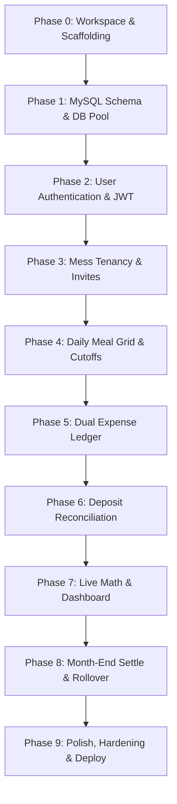

# STEP-BY-STEP PHASED IMPLEMENTATION ROADMAP
**Project**: Mess Management System  
**Approach**: Incremental, test-driven, single-developer friendly  
**Golden Rule**: Each phase has strict prerequisites, clear deliverables, and an **Independent Verification Test**. Do not move to Phase $N+1$ until Phase $N$ passes its verification test.

---

## Roadmap Overview & Dependency Graph

---

## Phase 0: Workspace & Project Scaffolding
**Goal**: Set up the repository, backend TypeScript environment, and frontend Vite project with Tailwind CSS.

### What to Build
1. **Repository Setup**: Initialize Git repo, create `.gitignore` for Node and frontend artifacts.
2. **Backend Scaffolding (`backend/`)**:
   - `npm init -y` with TypeScript, `express`, `cors`, `dotenv`, `mysql2`, `bcrypt`, `jsonwebtoken`.
   - Dev dependencies: `ts-node-dev`, `@types/express`, `@types/cors`, `@types/bcrypt`, `@types/jsonwebtoken`, `typescript`.
   - Setup `tsconfig.json` and `.env.example`.
   - Health check endpoint: `GET /api/health` -> `{ "status": "ok", "timestamp": "..." }`.
3. **Frontend Scaffolding (`frontend/`)**:
   - Vite + React + TypeScript template.
   - Install `tailwindcss`, `postcss`, `autoprefixer`, `react-router-dom`, `axios`, `lucide-react`.
   - Configure `tailwind.config.js` and test a styled Tailwind component.

### Independent Verification Test (Phase 0)
- [ ] Run `npm run dev` in `backend/` -> Server starts on port 5000; visiting `http://localhost:5000/api/health` in browser returns `{ status: "ok" }`.
- [ ] Run `npm run dev` in `frontend/` -> Vite dev server loads on port 5173 with custom Tailwind styling rendered correctly.
- [ ] No compilation or lint errors.

---

## Phase 1: Database Initialization & Raw SQL Connection Pool
**Goal**: Spin up the MySQL database, create all 8 tables, and build a reusable connection pool with transaction helper.

### What to Build
1. **Database Schema Script (`backend/src/db/schema.sql`)**:
   - Paste the frozen MySQL DDL containing all 8 tables (`users`, `messes`, `mess_members`, `billing_months`, `meals`, `expenses`, `deposits`, `monthly_settlements`) with constraints and generated columns.
2. **Database Module (`backend/src/config/db.ts`)**:
   - Create `mysql2/promise` connection pool with environment variables.
   - Create `withTransaction<T>(callback)` helper function for safe atomic operations.
3. **Migration Runner Script (`backend/src/db/initDb.ts`)**:
   - A one-shot CLI script (`npm run db:init`) that executes `schema.sql` against the database.

### Independent Verification Test (Phase 1)
- [ ] Run `npm run db:init`.
- [ ] Open MySQL workbench or terminal and run `SHOW TABLES;`. Verify all 8 tables are present.
- [ ] Run `DESCRIBE meals;`. Verify `total_meals` is a `STORED GENERATED` column.
- [ ] Run a test query in a scratch script verifying `withTransaction` can insert, commit, and rollback on error.

---

## Phase 2: User Authentication & JWT Flow
**Goal**: Allow users to register, log in, persist their JWT session, and access protected routes.

### What to Build
1. **Backend**:
   - `auth.service.ts`: Password hashing with bcrypt, raw SQL queries for user insert and email lookup, JWT generation.
   - `auth.controller.ts`: Handles input validation for `name`, `email`, `password`.
   - `auth.middleware.ts`: Extracts `Bearer <token>`, verifies JWT, and attaches `req.user = { userId, email }`.
   - Routes:
     - `POST /api/auth/register`
     - `POST /api/auth/login`
     - `GET /api/auth/me` (Protected with `auth.middleware`)
2. **Frontend**:
   - `src/services/api.ts`: Axios instance with request interceptor attaching token from `localStorage`.
   - `AuthContext.tsx`: Manages `user`, `token`, `login()`, `logout()`, `loading` states.
   - `LoginPage.tsx` & `RegisterPage.tsx` with clean form validation.
   - Protected route wrapper (`<ProtectedRoute />`).

### Independent Verification Test (Phase 2)
- [ ] Register a new user (`POST /api/auth/register`) -> Returns user object and JWT token. Check `users` table in MySQL to verify password is a bcrypt hash.
- [ ] Login with the registered user (`POST /api/auth/login`) -> Returns JWT.
- [ ] Attempt login with wrong password -> Returns `401 Unauthorized` with clear error message.
- [ ] Send request to `GET /api/auth/me` with header `Authorization: Bearer <token>` -> Returns user profile.
- [ ] Log in on the frontend -> Page redirects to onboarding; refresh browser -> User remains logged in.

---

## Phase 3: Mess Tenancy & Member Onboarding
**Goal**: Allow a user to create a mess (becoming Manager) or join an existing mess via an invite code (in `PENDING` status), and allow the Manager to approve join requests.

### What to Build
1. **Backend**:
   - `mess.service.ts`:
     - Create mess: Generates unique 6-character code (e.g., `MESS-4K7`), inserts row into `messes`, inserts caller into `mess_members` with `role = 'MANAGER'` and `status = 'ACTIVE'`, and initializes current calendar month in `billing_months`.
     - Join mess: Validates invite code, inserts caller into `mess_members` with `role = 'MEMBER'` and `status = 'PENDING'`.
     - List members: `GET /api/messes/:messId/members`.
     - Update status: `PATCH /api/messes/:messId/members/:memberId/status` (`ACTIVE` or `REJECTED`).
   - `role.middleware.ts`: `requireManager` and `requireActiveMember`.
2. **Frontend**:
   - `OnboardingPage.tsx`: Two prominent cards:
     - Card A: "Create a New Mess" (name, address, cutoff times).
     - Card B: "Join Existing Mess" (enter 6-character code).
   - `MembersPage.tsx`:
     - Displays member directory.
     - Manager sees "Pending Requests" with "Approve" and "Reject" buttons.

### Independent Verification Test (Phase 3)
- [ ] User A creates mess "Dorm 402" -> Receives invite code (e.g. `MESS-8X1`). Check `mess_members` table: User A is `MANAGER` + `ACTIVE`.
- [ ] User B registers and enters `MESS-8X1` -> Check `mess_members` table: User B is `MEMBER` + `PENDING`.
- [ ] User B cannot access protected mess pages (blocked by pending status).
- [ ] User A navigates to `/members`, sees User B's pending request, and clicks "Approve".
- [ ] User B's status updates to `ACTIVE`. User B can now access mess pages.

---

## Phase 4: Daily Meal Management & Cutoff Locking
**Goal**: Allow members to toggle daily meal counts (Breakfast, Lunch, Dinner) before cutoff, and provide the Manager with a master grid to edit any member's meals on any date.

### What to Build
1. **Backend**:
   - Cutoff validator function (`isMealLocked`).
   - Routes:
     - `PUT /api/meals/self`: Member updates personal meal counts for today/tomorrow. Server rejects with `403` if time > cutoff.
     - `PUT /api/meals/manager-override`: Manager updates any member's count on any date. Uses `INSERT ... ON DUPLICATE KEY UPDATE`.
     - `GET /api/meals/daily-sheet?messId=X&date=YYYY-MM-DD`: Returns matrix of all members and their meal counts for that day.
     - `GET /api/meals/my-monthly?messId=X&month=YYYY-MM`: Returns caller's daily meal logs for the month.
2. **Frontend**:
   - `MealsPage.tsx`:
     - Member view: Card displaying Today & Tomorrow with `+` and `-` buttons for Breakfast (0.5), Lunch (1.0), Dinner (1.0), and a status pill indicating whether cutoff is active or expired.
     - Manager view: Date picker and daily spreadsheet table listing all members with input fields for instant adjustment.

### Independent Verification Test (Phase 4)
- [ ] Member updates today's lunch count to `1.0`. Verify record created in `meals` with `total_meals = 1.00`.
- [ ] Simulate cutoff passing (or test with past date) -> `PUT /api/meals/self` returns `403 Forbidden` ("Cutoff time has passed").
- [ ] Manager sends `PUT /api/meals/manager-override` for that same date -> Succeeds with `200 OK`.
- [ ] Open MySQL: Verify `total_meals` automatically reflects the sum of breakfast, lunch, and dinner.

---

## Phase 5: Dual Expense Ledger (Bazar & Shared Fixed)
**Goal**: Track grocery/bazar expenses and shared overhead costs (rent, utilities) with Manager approval workflow.

### What to Build
1. **Backend**:
   - `POST /api/expenses`:
     - Fields: `category` (`BAZAR` or `SHARED_FIXED`), `title`, `amount`, `expenseDate`, `description`.
     - Logic: Auto-approved if created by Manager; status `'PENDING'` if submitted by Member.
   - `GET /api/expenses?messId=X&month=YYYY-MM&category=ALL|BAZAR|SHARED_FIXED`.
   - `PATCH /api/expenses/:id/status` (Manager approves/rejects).
   - `DELETE /api/expenses/:id` (Delete unapproved expense).
2. **Frontend**:
   - `ExpensesPage.tsx`:
     - Tab filter: "All", "Bazar (Meal)", "Shared Fixed (Rent/Utility)".
     - "Add Expense" Modal with category dropdown and validation.
     - Status badges (`PENDING` in yellow, `APPROVED` in green, `REJECTED` in red).
     - Manager action buttons: "Approve" / "Reject".

### Independent Verification Test (Phase 5)
- [ ] Member submits a ৳1,500 Bazar expense ("Chicken and Rice"). Check `expenses` table: status is `PENDING`.
- [ ] Manager logs into `/expenses`, sees pending item, and clicks "Approve". Status updates to `APPROVED`.
- [ ] Manager logs a ৳12,000 Shared Fixed expense ("House Rent"). Status is immediately `APPROVED`.
- [ ] Query `/api/expenses?category=BAZAR` -> Returns only the ৳1,500 grocery expense.

---

## Phase 6: Deposit Reconciliation & Payment Workflow
**Goal**: Record member monetary deposits (Cash, bKash, Nagad, Bank) with transaction references and Manager approval.

### What to Build
1. **Backend**:
   - `POST /api/deposits`:
     - Fields: `amount`, `depositDate`, `paymentMethod`, `transactionRef`, `notes`.
     - Logic: Manager entries are `APPROVED`; Member requests are `PENDING`.
   - `GET /api/deposits?messId=X&month=YYYY-MM`.
   - `PATCH /api/deposits/:id/status` (Manager approves/rejects).
2. **Frontend**:
   - `DepositsPage.tsx`:
     - Summary banner: Total Approved Deposits this month.
     - "Submit Deposit" Modal with payment method selector and TrxID field.
     - Deposits table with payer name, amount, method, date, status, and Manager approval buttons.

### Independent Verification Test (Phase 6)
- [ ] Member submits a deposit: ৳3,000 via `BKASH`, TrxID: `TRX982734`. Check `deposits` table: status is `PENDING`.
- [ ] Manager clicks "Approve" on `/deposits`. Status becomes `APPROVED`.
- [ ] Manager records direct cash payment of ৳2,000 on behalf of a member. Status is directly `APPROVED`.

---

## Phase 7: Live Financial Engine & Interactive Dashboard
**Goal**: Connect all live data into dynamic mathematical calculations and display real-time metrics on the Dashboard.

### What to Build
1. **Backend**:
   - `calculation.service.ts`:
     - Calculates `currentMealRate = totalApprovedBazar / totalMeals`.
     - Calculates `fixedSharePerMember = totalApprovedFixed / activeMemberCount`.
     - Calculates `memberNetBalance = openingBalance + totalApprovedDeposits - (memberMeals * mealRate + fixedShare)`.
   - Routes:
     - `GET /api/dashboard/summary?messId=X&month=YYYY-MM`: Overall mess KPIs.
     - `GET /api/dashboard/member-ledger?messId=X&month=YYYY-MM`: Array of each member's individual breakdown and net balance.
2. **Frontend**:
   - `DashboardPage.tsx`:
     - Top KPI Grid: **Current Meal Rate** (৳), **My Live Balance** (green if positive credit, red if due), **Total Bazar Expense**, **Total Mess Meals**.
     - Quick Today's Meal Widget.
     - Member Balance Overview Table showing everyone's current balance.

### Independent Verification Test (Phase 7)
- [ ] Seed/enter test data:
  - Total Mess Meals = 100.
  - Approved Bazar = ৳4,500 $\rightarrow$ Expected Meal Rate = `৳ 45.00`.
  - Approved Fixed Costs = ৳6,000 across 3 active members $\rightarrow$ Expected Fixed Share = `৳ 2,000.00`.
  - Member A has 40 meals and deposited ৳5,000.
    $$\text{Expense} = (40 \times 45) + 2000 = 1800 + 2000 = ৳ 3,800$$
    $$\text{Net Balance} = 5000 - 3800 = +৳ 1,200 \text{ (Credit)}$$
- [ ] Check `/api/dashboard/summary` and `/api/dashboard/member-ledger` -> Response numbers match manual calculation to the cent.
- [ ] Member A opens `/dashboard` -> Sees `My Balance: +৳ 1,200` in green.

---

## Phase 8: Month-End Settlement & Rollover Engine
**Goal**: Atomically close the calendar month, freeze historical records, generate immutable statements, and carry forward closing balances into next month's opening balance.

### What to Build
1. **Backend**:
   - `settlement.service.ts`:
     - Transactional `closeMonth(messId, monthYear)`:
       1. Check for any unresolved `PENDING` expenses or deposits -> Throw error if found.
       2. Calculate final meal rate and final member balances.
       3. Insert rows into `monthly_settlements` for every active member.
       4. Update `billing_months` status for current month to `'CLOSED'`.
       5. Create or activate next month (`YYYY-MM+1`) in `billing_months`.
   - Routes:
     - `POST /api/settlements/close-month` (Manager only).
     - `GET /api/settlements/:messId/:monthYear`: Returns final statement.
   - Guard updates: Meals, expenses, and deposits endpoints reject changes targeting a `'CLOSED'` month.
2. **Frontend**:
   - `SettlementPage.tsx`:
     - For Open Month: Settle preview table with warnings for pending items + "Close & Finalize Month" button (Manager only).
     - Confirmation Modal displaying final summary before execution.
     - For Closed Month: Immutable final statement view showing each member's exact dues or refunds.

### Independent Verification Test (Phase 8)
- [ ] Try to close month with 1 pending expense -> System returns `400 Bad Request` ("Cannot close month with pending expenses").
- [ ] Resolve pending item and execute `POST /api/settlements/close-month`.
- [ ] Check `billing_months`: Current month status is `'CLOSED'`. Next month is created as `'OPEN'`.
- [ ] Check `monthly_settlements`: Records exist for all members with frozen closing balances.
- [ ] Attempt to edit a meal in the closed month -> Returns `403 Forbidden` ("Billing month is closed").
- [ ] Query dashboard for the new month -> Each member's `opening_balance` equals their previous month's `closing_balance`.

---

## Phase 9: Edge Case Hardening, Polishing & Deployment Preparation
**Goal**: Test edge cases, refine UI responsiveness, and prepare environment configurations for production deployment.

### What to Build
1. **Edge Case Protections**:
   - Division-by-zero safeguard test (`Total Meals = 0` $\rightarrow$ Rate = `0.0000`).
   - Mid-month join testing (member approved on day 15).
   - Negative balance formatting (clear red `Due: ৳ 450` styling).
2. **UI & UX Polish**:
   - Toast notifications for success/error events.
   - Mobile responsive testing on smartphone viewport (hamburger sidebar, scrollable meal table).
   - Clean empty states ("No expenses recorded for this month yet").
3. **Deployment Configuration**:
   - Backend `Dockerfile` or Render build script (`npm run build` with `tsc`).
   - Frontend Vite production build verification (`npm run build`).

### Independent Verification Test (Phase 9)
- [ ] Run complete E2E scenario in a fresh mess with 2 users.
- [ ] Run `npm run build` in both `backend/` and `frontend/` -> Builds cleanly with zero TypeScript or bundle errors.

---

## Summary of Exact Implementation Order

| Phase # | Phase Title | Primary Output | Independent Test |
| :---: | :--- | :--- | :--- |
| **0** | Workspace & Scaffolding | Express + Vite + Tailwind skeleton | Health check & styled Vite page |
| **1** | MySQL Schema & DB Pool | 8 tables created, `db.ts` connection pool | `db:init` runs, tables verified in DB |
| **2** | User Authentication & JWT | Register, Login, JWT auth middleware | Register user, test token & persistent login |
| **3** | Mess Tenancy & Invites | Create mess, invite codes, member approval | User creates mess, roommate joins via code |
| **4** | Daily Meal Grid & Cutoffs | Self meal update, cutoff check, manager grid | Member updates lunch; past-cutoff fails |
| **5** | Dual Expense Ledger | Bazar & Shared Fixed expense tracking | Member submits grocery; Manager approves |
| **6** | Deposit Reconciliation | Member deposits & Manager approval | Member submits bKash payment; Manager verifies |
| **7** | Live Math & Dashboard | Dynamic meal rate, member live balances | Dashboard KPIs match exact manual math |
| **8** | Month-End Settlement Engine | Atomic month close & rollover balance | Final statements frozen; rollover carried over |
| **9** | Hardening & Polish | Edge case safeguards, mobile UI, prod build | Zero TypeScript errors, E2E flow verified |

*Ready to proceed with Phase 0 upon developer command.*
